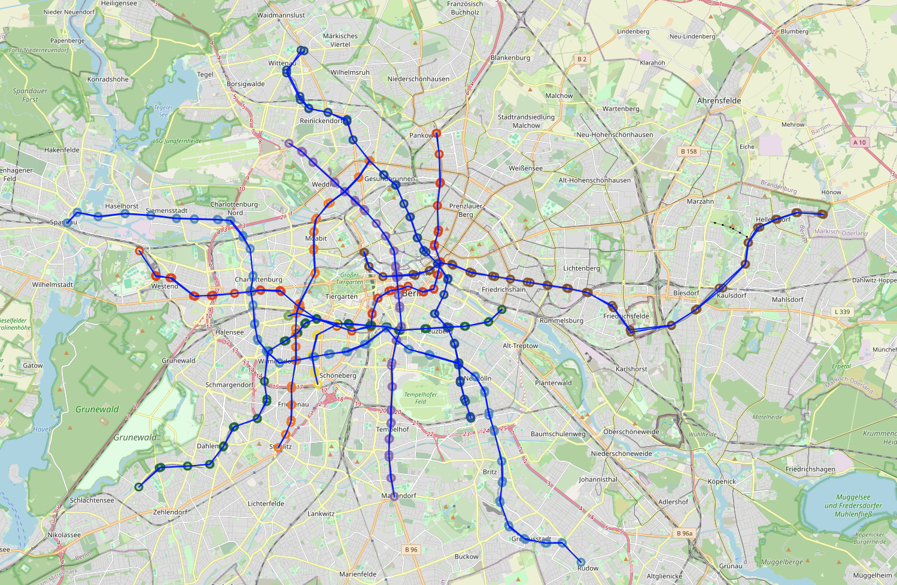

# Subway Route Data Extraction with Overpass API

### Overview
This project demonstrates how to extract, process, and visualize subway route data using the Overpass API, NetworkX, and Folium. The project focuses on creating a subway map for the Berlin subway system, showcasing routes and stations extracted directly from OpenStreetMap.

### Features
- **Overpass API Integration**: Extract real-time subway route data for Berlin.
- **Graph Representation**: Build and visualize a network graph of subway stations and routes using NetworkX.
- **Interactive Map**: Display subway routes on an interactive map using Folium, with hover functionality to display station names.

### Project Structure
```bash
Project_Name/
│
├── src/
│   ├── __init__.py          # Initializes the package
│   ├── main.py              # Entry point of the project
│   ├── data_extraction.py   # Handles OSM data extraction
│   ├── data_processing.py   # Processes extracted route and node data
│   ├── data_visualization.py# Visualizes the data using NetworkX and Folium
│
├── README.md                # Project documentation (this file)
├── requirements.txt         # Project dependencies
├── LICENSE                  # Project license
└── .gitignore               # Files to ignore in Git

## Interactive Subway Map

Below is a screenshot of the interactive subway map generated by the project. This map visualizes the subway routes and stops in Berlin.



You can interact with this map to explore the subway routes and see details about each stop.


